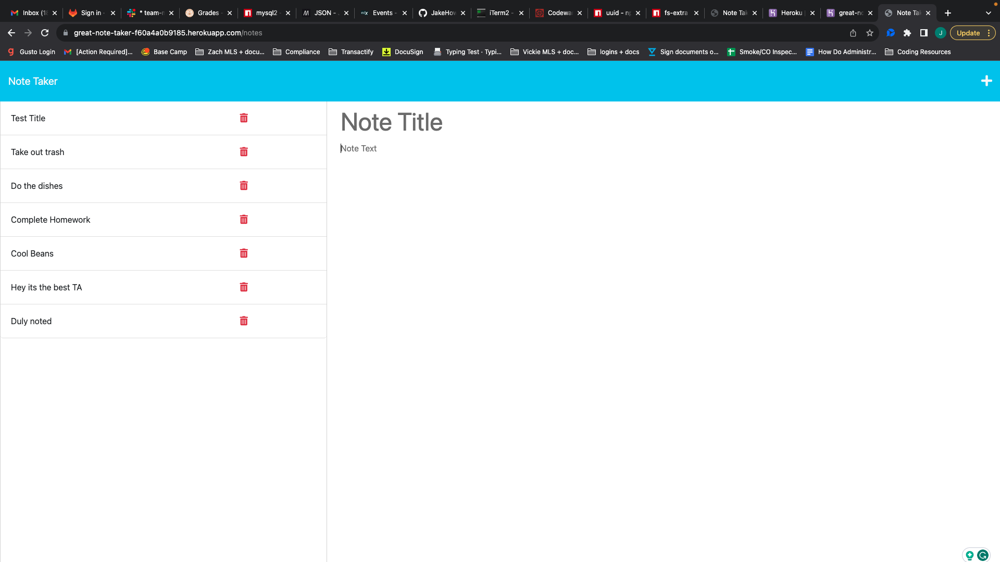

# Express.js Note Taker

## Description

AS A small business owner
I WANT to be able to write and save notes
SO THAT I can organize my thoughts and keep track of tasks I need to complete

GIVEN a note-taking application
WHEN I open the Note Taker
THEN I am presented with a landing page with a link to a notes page 

WHEN I click on the link to the notes page
THEN I am presented with a page with existing notes listed in the left-hand column, plus empty fields to enter a new note title and the note’s text in the right-hand column 

This was achieved through the creation of server side routes.

WHEN I enter a new note title and the note’s text
THEN a Save icon appears in the navigation at the top of the page 

WHEN I click on the Save icon
THEN the new note I have entered is saved and appears in the left-hand column with the other existing notes 

This was achieved through adding the POST method which wrote a new object to the array of objects located in the db.json file.

WHEN I click on an existing note in the list in the left-hand column
THEN that note appears in the right-hand column 

WHEN I click on the Write icon in the navigation at the top of the page
THEN I am presented with empty fields to enter a new note title and the note’s text in the right-hand column 

## Table of Contents

- [Installation](#installation)

- [Usage](#usage)

- [Questions](#questions)

- [Deployed-Webpage](#deployed-webpage)

## Installation

- Step 1: The user will need to have [Node.js](https://nodejs.org/en/download) installed on their PC or use the link provided to install it.

- Step 2: Before running the program the user will need to install the express & uuid package by typing 'npm install express' & 'npm install uuid' into the terminal integrated to the location of the folder holding the program.

- Step 3: The user will need to have a Heroku installed on their PC, this can be achieved by typing 'npm install -g heroku' into their terminal.

- Step 4: Heroku will need to be linked to your GitHub account. This can be accomplished after creating the app, under deployment method select GitHub. 

## Usage

This webpage was designed to allow the user to post, view and delete notes using server side methods to store, display and delete the user input notes.  

## Questions

Regarding any questions please check out my Github profile [JakeHowdeshell](https://github.com/JakeHowdeshell/node.js-readme-generator/tree/main).

Or send me an [email](mailto:Jakehowdy@gmail.com).

## Deployed Webpage

https://great-note-taker-f60a4a0b9185.herokuapp.com/notes